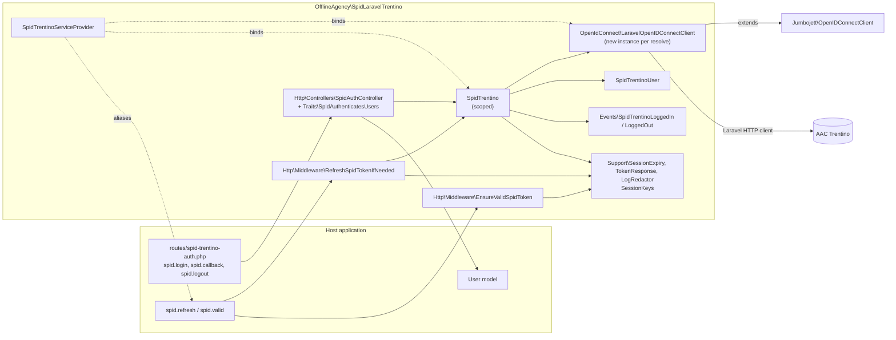

# Architecture

This page is for maintainers. It maps the classes under `src/`, how they are wired in the container, and where the OIDC library ends and the package begins.

## Component diagram



## Class map

| Class | Responsibility | Depends on |
|-------|----------------|------------|
| `SpidTrentinoServiceProvider` | Merges config, binds the OIDC client and the service, registers middleware aliases, views, routes (unless `register_routes` is false) and publish tags | Config, Router, URL |
| `SpidTrentino` | Service used by controller, middleware and facade: login redirect, callback, token refresh, logout, userinfo | `LaravelOpenIDConnectClient`, `TokenResponse`, `SessionExpiry`, `LogRedactor`, events, Auth, Session, Request, Log, Event facades |
| `SpidTrentinoFacade` | Facade with accessor `SpidTrentino::class` (alias `SpidTrentino`) | `SpidTrentino` |
| `OpenIdConnect\LaravelOpenIDConnectClient` | jumbojett adapted to Laravel (session, redirects, HTTP, caching, claim hardening, token response guard) | `Jumbojett\OpenIDConnectClient`, Session, Cache, Http, Request facades |
| `SpidTrentinoUser` | DTO of the userinfo claims, tolerant hydration, `toArray()` | none |
| `SessionKeys` | Constants for every session key | none |
| `Support\SessionExpiry` | Reads, writes and compares the access-token expiry | Session, Carbon |
| `Support\TokenResponse` | Normalizes token endpoint responses (object or array) | Carbon |
| `Support\LogRedactor` | Keyed hashes for log context | Config (`app.key`) |
| `Http\Controllers\SpidAuthController` | `login`, `callback`, `logout` actions | `SpidTrentino`, `SpidAuthenticatesUsers` |
| `Traits\SpidAuthenticatesUsers` | `authenticateFromSpid()`, `spidLoginFailed()`, `redirectTo()` | Eloquent, Auth, Session, Redirect, Config, Log |
| `Http\Middleware\RefreshSpidTokenIfNeeded` | Refresh within 60 s of expiry, forget tokens on failure | `SpidTrentino`, `SessionExpiry` |
| `Http\Middleware\EnsureValidSpidToken` | End the session when the SPID user or token is missing or expired | `SessionExpiry`, Auth, Session, Redirect, Response, URL |
| `Events\SpidTrentinoLoggedIn`, `Events\SpidTrentinoLoggedOut` | Carry the `SpidTrentinoUser` | `SpidTrentinoUser` |
| `Testing\MockOpenIDConnectClient` | Offline client for application tests | `LaravelOpenIDConnectClient` |

## Container bindings

| Abstract | Binding | Why |
|----------|---------|-----|
| `LaravelOpenIDConnectClient::class` | `bind` (new instance per resolution), built from config in `makeClient()` | The client holds per-flow state (tokens, discovery); never share it |
| `SpidTrentino::class` | `scoped` (one per request or job) | Safe under Octane and queue workers; the facade and the middleware get the same instance within a request |

`SpidTrentino` receives the client through constructor injection, and the controller and middleware receive `SpidTrentino` the same way. Nothing is created with `new`, so tests and applications can swap the client:

```php
use OfflineAgency\SpidLaravelTrentino\OpenIdConnect\LaravelOpenIDConnectClient;
use OfflineAgency\SpidLaravelTrentino\Testing\MockOpenIDConnectClient;

app()->instance(LaravelOpenIDConnectClient::class, new MockOpenIDConnectClient);
app()->forgetScopedInstances(); // only if SpidTrentino was already resolved in this request
```

## What jumbojett does, what the subclass changes

`Jumbojett\OpenIDConnectClient` (1.x) still implements the protocol: discovery, authorization request (state, nonce, PKCE), token request, ID token signature and claim verification, userinfo, refresh.

`LaravelOpenIDConnectClient` overrides:

| Method | Change |
|--------|--------|
| `authenticate()` | Passes the current request's `code`, `state`, `error`, `error_description` to `authenticateWith()` |
| `authenticateWith(array $parameters)` | New: swaps `$_REQUEST` with the whitelisted string parameters for the parent call, restores it in `finally`, clears the code verifier on success |
| `authorizationRedirect()` | New: returns the authorization redirect as a `RedirectResponse` |
| `redirect()` | Throws `HttpResponseException` instead of `header()` plus `exit` |
| `startSession()`, `commitSession()` | No-ops (the Laravel session is managed by `StartSession`) |
| `getSessionKey()`, `setSessionKey()`, `unsetSessionKey()` | Laravel session with `SessionKeys::OIDC_PREFIX` |
| `fetchURL()` | Laravel HTTP client; caches unauthenticated JSON GETs for `cache_ttl`; turns non-200 or non-JSON metadata and connection errors into `OpenIDConnectClientException` |
| `verifyJWTSignature()` | When jumbojett throws (for example an unknown `kid`), drops a cached JWKS once and retries; a plain `false` is not retried ([KI-06](known-issues.md#ki-06-key-rotation-that-keeps-the-same-key-id-is-not-retried)) |
| `verifyJWTClaims()` | Requires string `iss` and `sub`, the client id in `aud`, integer `exp` (ID tokens) before the parent checks |
| `requestTokens()` | Rejects token responses that are not objects or lack string `access_token` and `id_token` |
| `getResponseContentType()` | Returns the content type captured by the Laravel HTTP client |

## Design rules

- **No `Illuminate\Foundation` in `src/`.** The package requires `illuminate/*` components, not `laravel/framework`, so `src/` uses facades and contracts instead of helpers such as `config()`, `redirect()` or `now()`. An architecture test enforces it (`tests/Arch/ArchTest.php`).
- **No native session.** `src/` never reads `$_SESSION` (also enforced by an architecture test). `$_REQUEST` is touched only inside `authenticateWith()`.
- **Strict types** in every source file; PHPStan at level max without a baseline.
- **Exceptions:** protocol and provider failures surface as `Jumbojett\OpenIDConnectClientException`, which the controller turns into the error redirect. Configuration mistakes (`LogicException`, `InvalidArgumentException`) are left to surface as 500s.
