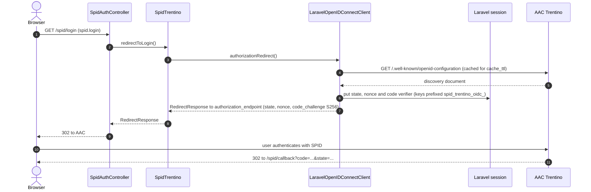
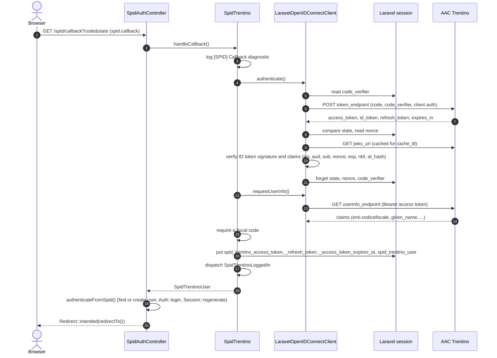
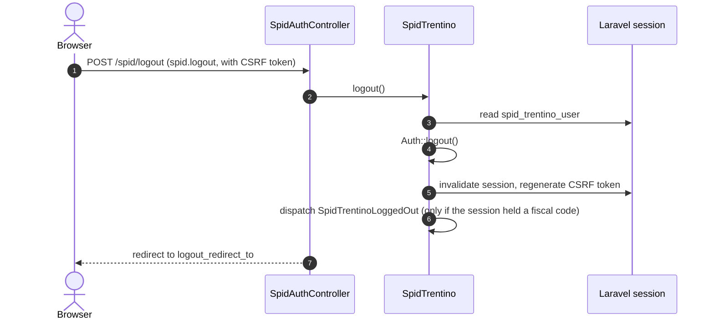

# Authentication flow

The package implements the OpenID Connect authorization code flow with PKCE against AAC Trentino. The OIDC protocol work is done by `jumbojett/openid-connect-php` through `OfflineAgency\SpidLaravelTrentino\OpenIdConnect\LaravelOpenIDConnectClient`, which keeps the round-trip state in the Laravel session and uses the Laravel HTTP client.

## Login

If AAC cannot be reached, or the discovery document is not valid JSON, `OpenIDConnectClientException` is caught by the controller and the user is redirected to `error_redirect_to` (see [failures](#failures)).

## Callback

Details:

- `authenticate()` passes only the `code`, `state`, `error` and `error_description` request parameters (as strings) to jumbojett. A callback without `code` and `error` starts a new authorization request, so the browser is sent back to AAC.
- jumbojett exchanges the code first and compares `state` afterwards ([KI-07](known-issues.md#ki-07-the-authorization-code-is-exchanged-before-the-state-is-checked)); a lost session therefore usually fails at the token request, see [troubleshooting](troubleshooting.md#login-fails-after-returning-from-aac-session-lost-second-tab-reloaded-callback).
- ID token verification is done by jumbojett with the keys from the discovered `jwks_uri`. The package adds stricter checks: string `iss` and `sub`, the client id in `aud`, and a mandatory integer `exp`. See [security](security.md#id-token-validation).
- The token response must be a JSON object with string `access_token` and `id_token`; anything else (for example a gateway error page) fails the login.
- A userinfo response without `enti-codicefiscale.fiscalCode` (or with only whitespace) fails the login with `AAC did not return a fiscal code for the authenticated user.`
- The user record is handled by `authenticateFromSpid()`, described in [user model](user-model.md).

## Post-login redirect

The controller returns `Redirect::intended($this->redirectTo())`:

1. If the session holds an intended URL (stored when `auth` or `spid.valid` redirected a guest), the user goes there.
2. Otherwise `redirectTo()` decides: `redirect_to` from the configuration when it is a non-empty string; `/admin/dashboard` when the user has `hasRole('admin')`; `/` in every other case.

Override `redirectTo()` in your own controller to change the logic, see [extending](extending.md).

## Failures

Any `Jumbojett\OpenIDConnectClientException` thrown during login or callback is handled by `spidLoginFailed()`:

1. The exception is logged with `[SPID] Authentication failed`.
2. The user is redirected to `error_redirect_to` (default `/`).
3. The flash message `SPID authentication failed. Please try again.` is stored under `SessionKeys::ERROR`.

The user is not logged in and no local user is created. The common causes and their log lines are listed in [troubleshooting](troubleshooting.md).

## Logout

The logout ends the application session only. The package does not call AAC's end-session endpoint, so the user's SPID session at the identity provider remains active.

## Related

- [Session and tokens](session-and-tokens.md)
- [Middleware](middleware.md)
- [Events](events.md)
